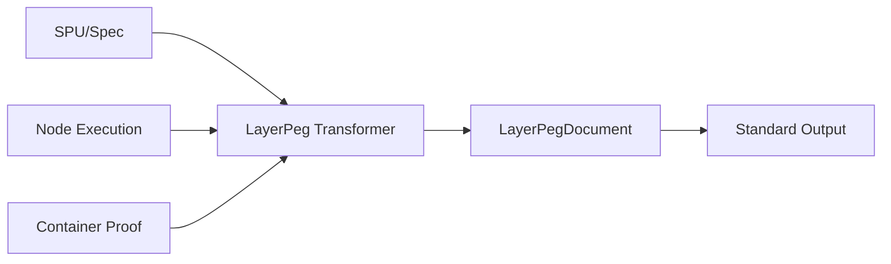

# LayerPeg Document Standard

更新时间：2026-04-23  
范围：统一系统对内/对外标准输出优先走 `LayerPegDocument`，保留现有 JSON 查看能力与旧字段兼容。

## 1. 标准 Schema（五层）

`LayerPegDocument` 固定为五层结构：

1. `Header`
2. `Gate`
3. `Body`
4. `Proof`
5. `State`

代码定义：
- `apps/executable-spec-web/src/layerpeg/document.ts`

JSON Schema：
- `apps/executable-spec-web/src/platform/schemas/layerpeg-document.schema.json`
- `apps/executable-spec-web/src/platform/schemas/layerpeg-document-index.schema.json`

## 2. 统一转换器

统一入口（Transformer Facade）：
- `layerPegFromSpu(spu, options)`
- `layerPegFromNodeExecution(node, options)`
- `layerPegFromContainerProof(proof, options)`

实现位置：
- 门面：`apps/executable-spec-web/src/layerpeg/transformer.ts`
- 构建器：`apps/executable-spec-web/src/layerpeg/document_builder.ts`

覆盖对象：
1. SPU/Spec
2. Node execution result
3. Container proof

## 3. 标准输出优先策略

新增统一标准输出包装：

```ts
interface LayerPegStandardOutput {
  format: "LayerPegDocument";
  schemaId: "layerpeg-document.schema.json";
  document: LayerPegDocument;
}
```

构建方法：
- `toLayerPegStandardOutput(document)`

接口返回策略：
1. 优先返回 `layerPegDocument` / `standardOutput`。
2. 旧字段（如 `node`、`proof`、`item`）继续保留，保证兼容。

## 4. API 统一落点

### 4.1 LayerPeg 文档读取（现有功能保留）

- `GET /api/layerpeg/spec/:spuId`
- `GET /api/layerpeg/node/:nodeId`
- `GET /api/layerpeg/container/:containerId/proof`
- `GET /api/layerpeg/documents`
- `GET /api/layerpeg/documents/:usi`

以上接口底层统一走 transformer。

### 4.2 业务接口（新增标准输出优先）

以下接口在原响应基础上附带：
- `layerPegDocument`
- `standardOutput`

覆盖：
1. `POST /api/registry/import`
2. `POST /api/spec/register-markdown`（注册成功时）
3. `POST /api/spec/register-template`（注册成功时）
4. `POST /api/gate/evaluate`
5. `POST /api/nodes`
6. `POST /api/nodes/:id/submit`
7. `POST /api/nodes/:id/sign`
8. `POST /api/nodes/:id/finalize`
9. `POST /api/containers/:id/archive`
10. `GET /api/containers/:id/proof`

## 5. JSON 查看能力

前端现有“读取规范文档 / 读取节点文档 / 读取容器 Proof 文档 / 查看 LayerPeg 文档 JSON”能力不变。

但底层统一为：
1. 通过 `layerPegFrom*` 系列转换器生成五层文档。
2. 文档账本与读取接口都返回同一 `LayerPegDocument` 结构。

## 6. Mermaid



## 7. 验收映射

1. 已定义五层 schema：`Header/Gate/Body/Proof/State`。
2. 已为 `SPU/Node/ContainerProof` 提供统一转换器。
3. 现有 JSON 查看功能保留，底层统一走 transformer。
4. 系统对内/对外响应已优先携带 `LayerPegDocument` 标准输出。
