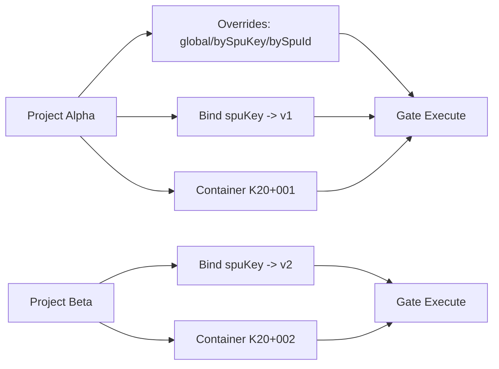

# Project Context（多项目上下文）

## 目标
- 从单项目 demo 升级到多项目并行能力。
- 同一 SPU Key 支持不同项目绑定不同版本并并行执行。
- 执行链路优先读取项目上下文中的版本绑定和参数 override。

## 模型定义

代码位置：
- [types.ts](/d:/wfj/project/normpeg-monorepo/apps/executable-spec-web/src/platform/types.ts)
- [platform-service.ts](/d:/wfj/project/normpeg-monorepo/apps/executable-spec-web/src/platform/workflow/platform-service.ts)

`ProjectContext`：
- `projectId`
- `boundSpuVersions: ProjectSpuVersionBinding[]`
- `overrides`
  - `global: Record<string, unknown>`
  - `bySpuKey: Record<string, Record<string, unknown>>`
  - `bySpuId: Record<string, Record<string, unknown>>`
- `activeContainers: string[]`
- `createdAt`
- `updatedAt`

`ProjectContextSummary`：
- `projectId`
- `boundSpuVersionCount`
- `activeContainerCount`
- `updatedAt`

## 执行优先级（关键）

执行 `gate evaluate` 时（`evaluateGateRequest`）：
1. 先通过 `containerId -> projectId` 读取项目上下文。
2. 先解析项目生效 SPU 版本（如果项目已绑定该 `spuKey`，以项目绑定版本为准）。
3. 再合并输入参数：
   - 输入基础值：请求 `inputs`
   - 叠加 `ProjectContext.overrides`（覆盖同名字段）
   - 合并顺序：`global` -> `bySpuKey` -> `bySpuId`
4. 最终使用“项目生效版本 + 合并后输入”进入 Gate 执行。

说明：
- 这不会改变 Gate 规则本身，只改变“执行时取哪个版本 + 取哪些项目参数”。
- 如果项目未绑定对应 `spuKey`，保留请求中的 `spuId` 执行。

## PlatformService 新增能力

- `upsertProjectContext({ projectId, overrides })`
- `getProjectContext(projectId)`
- `listProjectContexts()`
- `resolveProjectExecutionSpuId(projectId, requestedSpuId)`
- `resolveProjectExecutionInputs({ projectId, spuId, inputs })`

## 最小 API

服务端：
- `POST /api/projects/context`
  - 用途：写入/更新项目 overrides。
- `GET /api/projects`
  - 用途：项目列表（最小摘要）。
- `GET /api/projects/:projectId`
  - 用途：项目详情（含绑定版本、overrides、active containers）。

客户端封装：
- [api-client.ts](/d:/wfj/project/normpeg-monorepo/apps/executable-spec-web/src/platform/api-client.ts)
  - `upsertProjectContext(...)`
  - `listProjectContexts()`
  - `getProjectContext(projectId)`

## 关系图

## 验收映射

- 同一个 SPU 可在项目 A 用 `v1`、项目 B 用 `v2` 并行执行：已支持。
- Gate 执行时读取项目上下文版本与 override：已接入 `evaluateGateRequest`。
