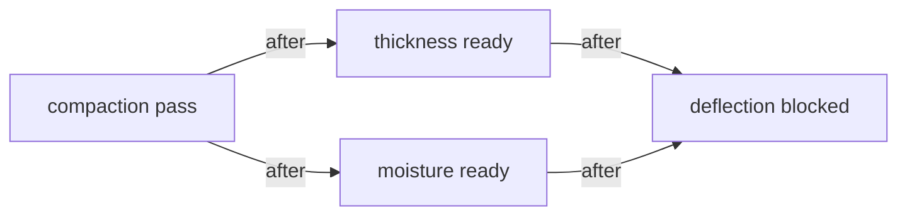

# Runtime Graph (Minimum Viable)

## Goal
- Upgrade Runtime from "recommend next task" to "explicit executable graph model".
- Make scheduling logic explicit in platform runtime layer, not hardcoded in page UI.

## Minimal Graph Structure

Code:
- [runtime-graph.ts](/d:/wfj/project/normpeg-monorepo/apps/executable-spec-web/src/platform/runtime/runtime-graph.ts)
- [runtime-scheduler.ts](/d:/wfj/project/normpeg-monorepo/apps/executable-spec-web/src/platform/runtime/runtime-scheduler.ts)

### Node
- `nodeId`
- `spuId`
- `executionStatus`
  - `draft | ready | running | pass | failed | blocked`

### Edge
- `edgeId`
- `fromNodeId`
- `toNodeId`
- `dependencyType`
  - currently minimal: `"after"`

## Scheduling Semantics (Minimal)

### 1) `after` dependencies
- Node `B` can execute only when all incoming `after` dependencies are `pass`.

### 2) parallel possible
- If multiple nodes are `ready` (or `failed` for retry) and all their dependencies are satisfied, they are all returned as `nextExecutableNodes`.
- This means runtime can represent parallel candidates in one calculation round.

### 3) blocked by status
- If any upstream dependency node is not `pass`, downstream node is marked as blocked in computation result (`blockedNodes`).

## Core Compute Function

Function:
- `computeRuntimeNextExecutableNodes(graph)`

Output:
- `nextExecutableNodes[]`
- `blockedNodes[]`

Container runtime entry:
- `computeRuntimeContainerNextExecution(...)` now:
  1. builds explicit graph from runtime task models
  2. computes next executable nodes from graph
  3. returns `graph + nextExecutableNodes + blockedNodes` in scheduler response

API runtime model now includes:
- `scheduler.graph`
- `scheduler.nextExecutableNodes`
- `scheduler.blockedNodes`

## Project Example Graph

Interpretation:
- After `A` passes, `B` and `C` are both executable (parallel possible).
- `D` remains blocked until both `B` and `C` are `pass`.

## Acceptance Mapping

- Runtime is no longer only recommendation text: it now computes from explicit `nodes + edges`.
- Scheduling logic is centralized in runtime graph computation, not page hardcode.
