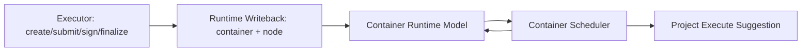

# Runtime Model (Executor -> Runtime)

更新时间：2026-04-23  
范围：让执行结果真正驱动运行态调度，不改大视觉，仅统一运行时结构与回写链路。

## 1. 目标

本次将 Runtime 统一为“可执行模型”而不是“展示模型”：

1. 定义 `Container` 最小运行时模型（可直接调度）。
2. 定义 `Node` 实例模型（一次 SPU 执行实例）。
3. 执行完成后自动回写 `container` 状态。
4. 基于 `node 状态 + dependsOn` 输出下一可执行项。
5. 固定 `project-level` 调度建议结构。

## 2. Container 最小运行时模型

文件：`src/platform/runtime/runtime-model.ts`

```ts
interface RuntimeContainerModel {
  containerId: string;
  lifecycleState: "DRAFT" | "RUNNING" | "VERIFIED" | "ARCHIVED";
  overallStatus: "PENDING" | "PASS" | "FAIL";
  runtime: {
    currentSpuId: string | null;
    currentNodeId: string | null;
    phase: "idle" | "running" | "signing" | "completed";
  };
  dependencyGraph: Record<string, string[]>;
  specBindings: Array<{
    spuId: string;
    status: "DRAFT" | "RUNNING" | "PASS" | "FAIL";
    latestNodeId: string | null;
    attempts: number;
    dependsOn: string[];
  }>;
  latestNodeStatusBySpu: Record<string, NodeStatus | null>;
  nodeSummary: {
    totalAttempts: number;
    activeAttempts: number;
    finalPassAttempts: number;
    finalFailAttempts: number;
  };
  nextExecution: {
    action: "EXECUTE" | "RETRY_FAILED" | "WAIT" | "ARCHIVE_READY";
    nextTask: string | null;
    blockedBy: string[] | null;
    reason: string;
  };
}
```

依赖推导规则：`dependsOn` 与 `dependencyGraph` 由 `specBindings` 顺序推导为“完整前序链”（而不是仅前一个）。

## 3. Node 实例模型

文件：`src/platform/runtime/runtime-model.ts`

```ts
interface RuntimeNodeModel {
  nodeId: string;
  containerId: string | null;
  spuId: string;
  attemptIndex: number;
  status: NodeStatus;
  isFinal: boolean;
  finalResult: "pass" | "fail" | "pending";
  gatePassed: boolean;
  requiredSignatures: string[];
  signedBy: string[];
  dependencySpuIds: string[];
  dependencyNodeIds: string[];
  createdAt: string;
  updatedAt: string;
}
```

## 4. 回写链路（执行完成后自动回写）

文件：`src/platform/workflow/platform-service.ts`

1. `createNode`：创建实例并回写  
   `runtime.currentSpuId/currentNodeId`, `phase=running`。
2. `submitNode`：执行 Gate，更新 node/binding，`recomputeContainer()`。
3. `signNode`：更新签字状态，`phase=signing`。
4. `finalizeNode`：形成 `FINAL_PASS | FINAL_FAIL`，回写 container：
   1. PASS：自动推进下一 `spu`（或 `phase=completed`）。
   2. FAIL：停留当前 `spu`，进入可重试态。
5. 前端每次执行后刷新 `/api/runtime/containers/:id/model`，调度建议立即更新。

## 5. 下一可执行项（基于 node + 依赖）

文件：`src/platform/runtime/runtime-scheduler.ts`

`RuntimeContainerTaskModel`：

```ts
interface RuntimeContainerTaskModel {
  spuId: string;
  status: "ready" | "blocked" | "running" | "pass" | "fail" | "failed";
  latestNodeId: string | null;
  dependsOn: string[];
}
```

决策优先级：

1. 有运行中 node -> `WAIT`
2. 有失败项 -> `RETRY_FAILED`
3. 有依赖满足的 ready 项 -> `EXECUTE`
4. 全部 pass -> `ARCHIVE_READY`
5. 其余 -> `WAIT`

## 6. Project-Level 调度建议结构

文件：`src/platform/runtime/runtime-scheduler.ts`

```ts
interface RuntimeProjectExecuteSuggestion {
  generatedAt: string;
  input: ProjectSchedulerInput;
  decision: ProjectScheduleDecision;
}
```

`POST /api/runtime/project-execute` 统一返回该结构（无论外部传参还是系统快照）。

## 7. Runtime API 标准产物

### 7.1 容器运行时模型

`GET /api/runtime/containers/:id/model`

```json
{
  "container": {},
  "nodes": [],
  "scheduler": {
    "containerId": "container_xxx",
    "input": {},
    "tasks": [],
    "nextTasks": [],
    "decision": {}
  }
}
```

### 7.2 项目级执行建议

`POST /api/runtime/project-execute`

```json
{
  "generatedAt": "2026-04-23T12:00:00.000Z",
  "input": { "containers": [] },
  "decision": {
    "action": "PROJECT_EXECUTE",
    "nextContainer": "K19+070",
    "nextTask": "highway.subgrade.thickness@v1"
  }
}
```

## 8. Mermaid 流程图



## 9. 验收对应

1. 一个 SPU 执行完成后，系统自动更新 container：由 `finalizeNode + recomputeContainer + runtime model refresh` 保证。
2. Runtime 区给出可信下一步建议：前端已改为消费 `/api/runtime/*` 输出，不再依赖旧展示拼装。
