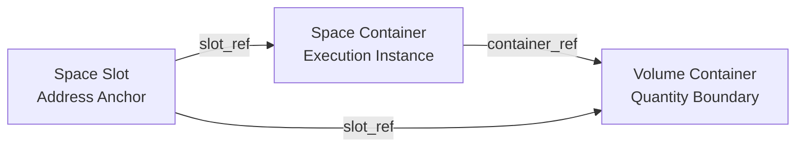

# Spatial Model 最小正式模型（v0）

更新时间：2026-04-24  
范围：将空间协议层正式化为 `Space Slot / Space Container / Volume Container` 三对象模型。

## 1. 设计原则

本模型采用强分层语义：

- `Space Slot` 只负责地址定位（地理语义）。
- `Space Container` 只负责规范执行（运行时语义）。
- `Volume Container` 只负责体积与工程量（计量语义）。

约束（MUST）：

1. 不再使用单一 `container` 同时承载地址、执行、工程量三类语义。  
2. `Space Container` 不作为工程量权威来源。  
3. `Volume Container` 不作为规范执行状态权威来源。  
4. `Space Slot` 不承载执行状态与工程量。

## 2. 三类对象正式 Schema

### 2.1 Space Slot Schema（地址层）

```ts
type SpaceSlot = {
  slot_id: string;                // 例: slot-K19+070
  v_address: string;              // 例: v://space/slot/K19+070
  slot_type: "geo_reference";
  geo: {
    station: string;              // 例: K19+070
    chainage: number;             // 例: 19070
    coords: {
      x: number;
      y: number;
    };
    elevation: number;
    alignment: string;
  };
  created_from: string;           // api/design file/import source
  is_static: true;
};
```

字段约束：

- `slot_type` 固定为 `geo_reference`。
- `is_static` 固定为 `true`（P0 阶段）。
- `v_address` 前缀应为 `v://space/slot/`。

### 2.2 Space Container Schema（执行层）

```ts
type SpaceContainer = {
  container_id: string;           // 例: container-K19+070
  v_address: string;              // 例: v://space/container/K19+070
  container_type: "execution_instance";
  slot_ref: string;               // canonical: 指向 SpaceSlot.v_address
  geo_slot_ref?: string;          // alias for backward compatibility
  volume_ref?: string | null;     // 可选: 主绑定 volume

  norm_execution: {
    specs_bound: string[];        // 绑定 SPU 列表
    current_state: "DRAFT" | "RUNNING" | "VALIDATED" | "REJECTED" | "ARCHIVED";
    gate_open: boolean;
  };
  spec_bindings: Array<{
    spuId: string;
    status: "DRAFT" | "RUNNING" | "PASS" | "FAIL";
    latest_node: string | null;
  }>;

  trip_binding: {
    inspector: string;
    supervisor: string;
  };
  runtime: {
    active_form: string;
    last_input: string;
    pending_action: "" | "EXECUTE_NODE" | "RETEST" | "READY_TO_ARCHIVE" | "MANUAL_REVIEW" | "LOCKED";
  };

  lifecycle: string;              // 例: active
  lifecycle_state: "DRAFT" | "RUNNING" | "VALIDATED" | "REJECTED" | "ARCHIVED";
  locked: boolean;
  is_dynamic: boolean;
  nodes: string[];
  container_proof?: Record<string, unknown> | null;
};
```

字段约束：

- `slot_ref` 为正式字段；`geo_slot_ref` 为兼容别名。
- `container_type` 固定为 `execution_instance`。
- 允许 `volume_ref` 为空，表示执行容器尚未绑定工程量边界。

### 2.3 Volume Container Schema（工程量层）

```ts
type VolumeContainer = {
  volume_id: string;              // 例: K19+070-zone96
  volume_ref: string;             // 例: v://space/volume/K19+070-zone96
  container_ref: string;          // 指向 SpaceContainer.v_address
  slot_ref: string;               // 指向 SpaceSlot.v_address（用于地址回溯）

  project_id?: string;
  branch_id?: string;
  station_start: number;          // chainage start
  station_end: number;            // chainage end
  layer: string;                  // 例: zone-96

  quantity: number | null;        // 可为空，表示待计量
  unit: string;                   // 默认 m3
  geometry: Record<string, unknown>;
};
```

字段约束：

- `station_start <= station_end`。
- `volume_ref` 前缀应为 `v://space/volume/`。
- `container_ref` 必须可解析到一个有效 `SpaceContainer`。

## 3. 三者关系（正式）

### 3.1 语义关系

1. `slot` 提供地址：地理锚点、桩号、坐标来源。  
2. `space container` 绑定执行：SPU、Node、生命周期、Proof。  
3. `volume container` 绑定工程量：层位、体积、几何、计量单位。

### 3.2 基数关系

- 一个 `SpaceSlot` 可对应多个 `SpaceContainer`（不同分支/执行阶段）。
- 一个 `SpaceContainer` 必须绑定一个 `SpaceSlot`（`slot_ref`）。
- 一个 `SpaceContainer` 可绑定 0..N 个 `VolumeContainer`。
- 一个 `VolumeContainer` 必须绑定一个 `SpaceContainer` 与一个 `SpaceSlot`。

### 3.3 关系图



## 4. 现有 container 数据迁移映射

### 4.1 输入来源（当前系统）

1. `space_context` 中的 container（执行主数据）。  
2. `mapping.containers`（地址+运行态聚合）。  
3. `mapping.volumes`（体积与工程量记录）。

### 4.2 迁移输出

- `slots[]`（SpaceSlot）
- `space_containers[]`（SpaceContainer）
- `volume_containers[]`（VolumeContainer）
- `migration_report[]`（每条记录保留来源与转换状态）

### 4.3 字段映射规则

### A. 旧 container -> SpaceSlot

优先级：

1. 旧字段 `geo_slot_ref` / `slot_ref` 可直接命中已有 slot。  
2. 若仅有 `vuri` 或 `v_address`，从 stake 解析 station/chainage 生成 slot。  
3. 若仅有 `stationStart/stationEnd`，用区间中点生成 slot（`coords` 可置空占位值并标记来源）。

映射：

- `slot_id` <- `slot v_address` tail
- `v_address` <- 已有 `slot_ref` 或新建 `v://space/slot/{station}`
- `geo.station/chainage` <- stake 或 station range 解析
- `created_from` <- `api/import/migration`

### B. 旧 container -> SpaceContainer

映射：

- `v_address` <- 旧 `v_address`；若缺失则由 `containerId` 生成 `v://space/container/{id}`
- `container_id` <- `v_address` tail 或 `containerId`
- `slot_ref` <- 迁移得到的 `SpaceSlot.v_address`
- `geo_slot_ref` <- 同 `slot_ref`（兼容）
- `volume_ref` <- 旧 `volume_ref`（若存在）
- `norm_execution/spec_bindings/runtime/lifecycle_state` <- 旧执行字段直接映射
- `trip_binding/nodes/container_proof` <- 原样迁移

### C. 旧 volume 数据 -> VolumeContainer

映射：

- `volume_id` <- 旧 `volumeId`
- `volume_ref` <- `v://space/volume/{volumeId}`（若旧值不存在则生成）
- `container_ref` <- 通过 `containerId` 关联到迁移后的 `SpaceContainer.v_address`
- `slot_ref` <- 由关联容器继承
- `station_start/station_end/layer/quantity/geometry` <- 旧 volume 字段映射
- `unit` <- 默认 `m3`（若旧值有单位则保留）

### 4.4 冲突与回退策略

1. 一个 `containerId` 对应多个 `slot_ref`：按最新 `updated_at`（无则按写入顺序）选主，其余写入 `migration_report.conflicts`。  
2. 找不到 `container_ref` 的 volume：保留为孤立 volume，状态标记 `orphan=true`，禁止参与结算。  
3. `station_start/station_end` 非法：该条迁移失败并记录错误，不阻塞其它记录。

### 4.5 迁移后兼容字段

为平滑升级，保留以下兼容别名：

- `SpaceContainer.geo_slot_ref`（别名）= `slot_ref`
- 创建容器接口入参 `slot_address`（旧）与 `slot_ref`（新）并行支持

## 5. Mapping 分层职责（迁移后）

Mapping 必须显式分层输出：

1. 地址层：`slot`（定位、反查、区间命中）  
2. 执行层：`space container`（状态、SPU、待办）  
3. 工程量层：`volume container`（体积、层位、几何、数量）

判定标准：

- 任一查询结果必须可区分“地址命中”与“执行命中”与“工程量命中”，不再仅返回单一 container 结构。

## 6. 验收对照

1. 以后不再用一个 container 混装所有语义：三对象模型已强制分层。  
2. Mapping 能清楚区分地址、执行、工程量：`slot/container/volume` 关系与迁移规则已明确。
