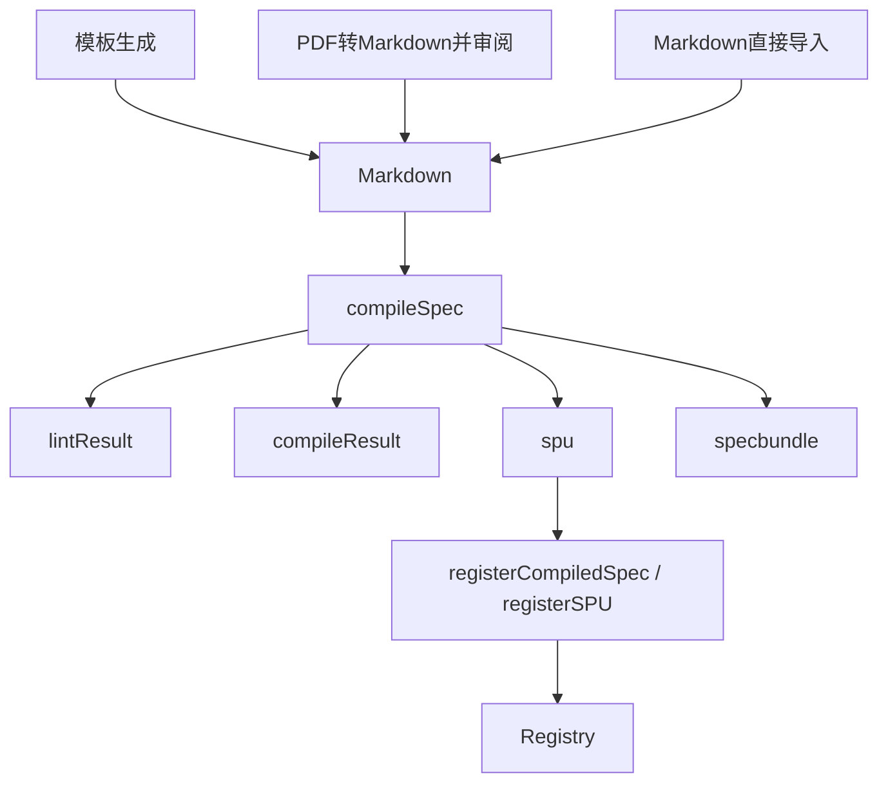

# Spec Build Pipeline

Updated: 2026-04-23
Scope: 统一模板、PDF、Markdown 三条规范生产入口，最终收敛到同一编译与注册产物。

## 1. 目标与统一产物

三条入口最终统一到 `compileSpec()`，并输出同一标准字段：

- `specbundle`
- `spu`
- `lintResult`
- `compileResult`

兼容字段：`spuSchema` 仍保留为 `spu` 的别名（向后兼容历史调用方）。

## 2. 三条入口代码路径

### 2.1 模板生成入口

1. UI: `apps/executable-spec-web/src/components/SpecTemplateLibraryPanel.tsx`
2. API: `POST /api/spec/register-template`
3. Server service: `apps/executable-spec-web/server/services/spec-template-service.ts`
4. Core: `apps/executable-spec-web/src/spec-compiler/templates/create_from_template.ts`
5. 编译链路：
   - `renderMarkdownFromTemplate(...)`
   - `registerMarkdownSpec(service, markdown, "template")`
   - `compileSpec(markdown, { source: "template" })`

### 2.2 PDF -> Markdown -> 审阅 -> 注册入口

1. UI: `apps/executable-spec-web/src/components/PDFToMarkdownDraftPanel.tsx`
2. Draft API: `POST /api/spec/pdf-to-draft`
3. Draft service: `apps/executable-spec-web/server/services/pdf-draft-service.ts`
4. Draft core: `apps/executable-spec-web/src/spec-compiler/pdf_to_markdown/pdf_to_draft.ts`
5. 注册时统一编译链路：
   - `POST /api/spec/register-markdown`
   - `registerMarkdownSpec(service, markdown, "pdf")`
   - `compileSpec(markdown, { source: "pdf" })`

### 2.3 Markdown 直接导入入口

1. UI: `apps/executable-spec-web/src/components/MarkdownSpecImportPanel.tsx`
2. API: `POST /api/spec/register-markdown`
3. Core: `apps/executable-spec-web/src/spec-compiler/register_markdown.ts`
4. 编译链路：
   - `registerMarkdownSpec(service, markdown, "markdown")`
   - `compileSpec(markdown, { source: "markdown" })`

## 3. 统一编译入口：`compileSpec()`

文件：`apps/executable-spec-web/src/spec-compiler/compile_spec.ts`

```ts
compileSpec(markdown, { source })
```

输入：

- `markdown: string`
- `source: "template" | "pdf" | "markdown"`

成功输出（统一标准）：

- `lintResult`
- `compileResult: { success: true, stage: "completed", source, compiledAt, spuId }`
- `spu`
- `specbundle: { fileName, byteLength, base64 }`

失败输出（统一标准）：

- `lintResult`
- `compileResult: { success: false, stage: "lint" | "compile" | "bundle", ... }`
- `spu: null`
- `specbundle: null`

## 4. 注册区统一标准产物

注册区只消费统一编译产物中的标准字段，不再依赖入口差异：

1. `registerMarkdownSpec(...)` 先得到 `compileArtifact`。
2. 注册仅使用 `compileArtifact.spu`（通过 `registerCompiledSpec(...)` -> `registerSPU(...)`）。
3. 所有入口最终注册返回统一字段：`lintResult / compileResult / spu / specbundle`。

说明：`/api/spec/register-markdown` 在 `pre_register_review` 阻断阶段也返回同名字段（值为 `null`），保持响应结构稳定。

## 5. API 输出统一

以下接口统一提供标准产物字段：

- `POST /api/spec/register-markdown`
- `POST /api/spec/register-template`

统一字段：

- `lintResult`
- `compileResult`
- `spu`
- `specbundle`

兼容字段继续保留：

- `compileArtifact`
- `lint`
- `json`
- `spuSchema`

## 6. Mermaid 流程图



## 7. 验收映射

- 三条入口最终产物一致：是（统一经 `compileSpec()` 输出同一标准字段）。
- 注册区只认一种标准产物：是（注册逻辑统一消费 `compileArtifact.spu`，并统一返回标准产物字段）。
