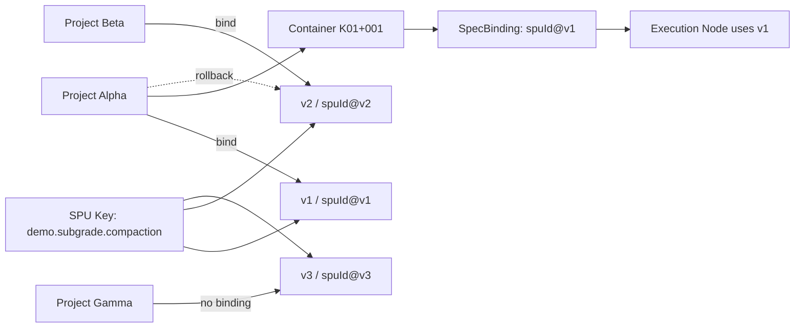

# Spec / SPU Versioning

## 目标
- 支持同一 `spuKey` 多版本并存（如 `v1`、`v2`）。
- 支持发布新版本且保留旧版本。
- 支持项目绑定指定版本、回滚版本、查询当前生效版本。
- 提供版本差异摘要（新增字段、规则变化、阈值变化）。

## 版本模型

### 语义化版本字段
- `major`: 不兼容变更
- `minor`: 向后兼容的功能扩展
- `patch`: 向后兼容的修复

代码位置：
- [types.ts](/d:/wfj/project/normpeg-monorepo/apps/executable-spec-web/src/platform/types.ts)
- [spu-versioning.ts](/d:/wfj/project/normpeg-monorepo/apps/executable-spec-web/src/platform/versioning/spu-versioning.ts)

`SPUDefinition.meta` 新增：
- `semanticVersion?: { major, minor, patch }`
- `compatibilityPolicy?: "major_breaking" | "minor_backward_compatible" | "patch_hotfix"`

说明：
- 仍兼容现有 `meta.version`（如 `v1`、`v2`、`v1.2.3`）。
- 系统会将 `v1` 规范化为 `1.0.0` 语义版本进行比较。

## 版本策略与兼容策略
- `major_breaking`: 预期存在不兼容变化，旧项目需显式迁移或回滚。
- `minor_backward_compatible`: 新增能力且保持兼容。
- `patch_hotfix`: 热修复，不改变既有契约。

兼容策略默认值：`minor_backward_compatible`。

## 能力清单

### 1) 发布新版本并保留旧版本
实现：
- `NormRegistry.publish(...)`
- `PlatformService.publishSpuVersion(...)`

行为：
- 新 `spuId`（同 `spuKey` 不同版本）可并存。
- 默认不覆盖已有同 `spuId`。

### 2) 项目绑定指定版本
实现：
- `PlatformService.bindProjectSpuVersion({ projectId, spuKey, selector })`

绑定结果包含：
- `activeSpuId`
- `version`
- `semanticVersion`
- `compatibilityPolicy`
- `boundAt`

### 3) 回滚版本
实现：
- `PlatformService.rollbackProjectSpuVersion({ projectId, spuKey, targetVersion })`

本质：
- 将项目绑定切回指定历史版本（例如从 `v2` 回到 `v1`）。

### 4) 查询当前生效版本
实现：
- `PlatformService.getCurrentEffectiveVersion(projectId, spuKey)`
- `PlatformService.resolveProjectEffectiveSpu(projectId, spuKey)`

返回来源：
- `project_binding`: 项目显式绑定
- `latest`: 未绑定时默认取该 `spuKey` 最新版本

## 执行侧如何知道绑定版本
- `SpaceContainer` 新增 `projectId`。
- `ContainerSpecBinding` 新增可选字段：
  - `spuKey`
  - `version`
  - `semanticVersion`

容器绑定规范时（`bindSpu` / `bindSpuByKey`）会落入上述字段，执行节点沿用该 `spuId`，因此可明确追溯“执行时用的是哪个版本”。

## 差异摘要函数
实现：
- `summarizeSpuVersionDiff(previous, next)`
- `PlatformService.summarizeSpuVersionDiff(fromSpuId, toSpuId)`

输出包含：
- `addedFields.inputs / outputs`
- `ruleChanges.added / removed / changed`
- `thresholdChanges`

适用于上线评审、回归评估、版本说明生成。

## API（可选联调）
服务端新增：
- `GET /api/registry/spu-versions?spuKey=...`
- `POST /api/registry/spu-versions/publish`
- `POST /api/versioning/projects/bind`
- `POST /api/versioning/projects/rollback`
- `GET /api/versioning/projects/:projectId/bindings`
- `GET /api/versioning/projects/:projectId/effective?spuKey=...`
- `POST /api/versioning/spu-diff`

客户端封装：
- [api-client.ts](/d:/wfj/project/normpeg-monorepo/apps/executable-spec-web/src/platform/api-client.ts)

## 版本关系图

